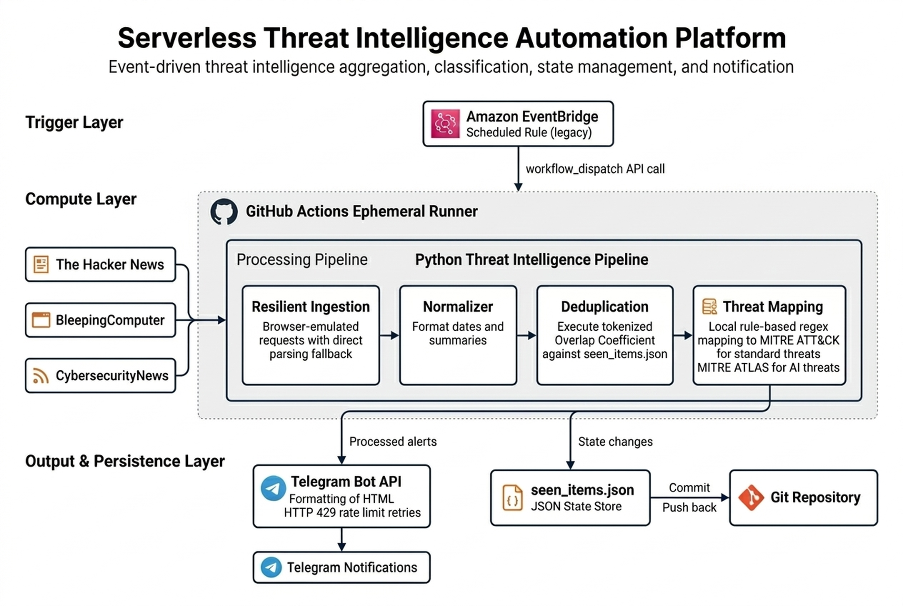
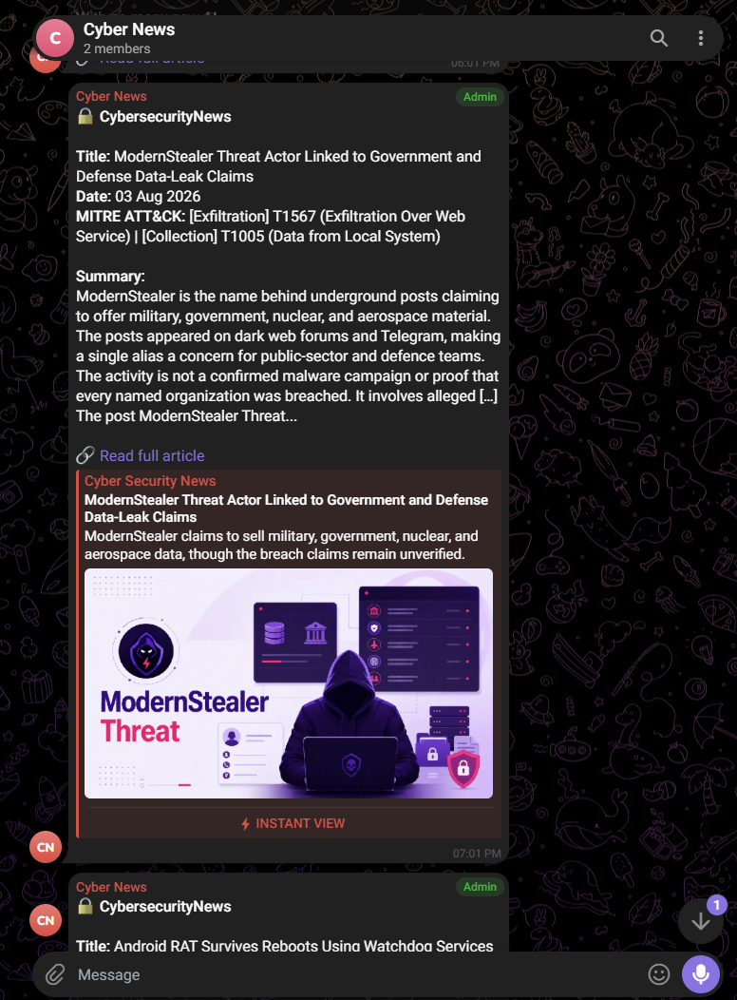
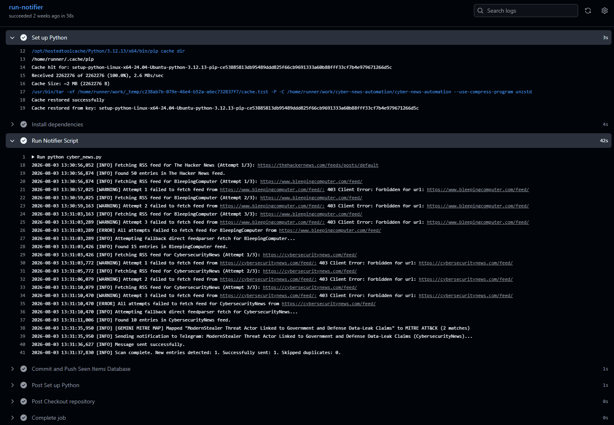

# Serverless Threat Intelligence Automation Platform

Automated threat intelligence aggregation, deduplication, classification, and notification using GitHub Actions, Amazon EventBridge, and Python.
[](https://www.python.org/)
[](https://github.com/features/actions)
[](https://aws.amazon.com/eventbridge/)
[](https://core.telegram.org/bots/api)
[](https://attack.mitre.org/)
[](#)


## Overview

I built this project to automate my own cybersecurity news and threat intelligence monitoring workflow. I wanted a lightweight way to aggregate updates from multiple security news sources, reduce duplicate coverage, classify relevant threats, and receive curated alerts without relying on a continuously running server or paid infrastructure.

The resulting pipeline automates feed ingestion, normalization, deduplication, threat classification, and Telegram notification using GitHub Actions, Amazon EventBridge, Python, and a lightweight JSON state store.

The project is primarily a practical demonstration of security architecture, automation, resilient integration design, and problem-solving through a working implementation.

## Why This Project?

I wanted to go beyond simply consuming threat intelligence feeds and explore how a practical automation workflow could be designed around real-world engineering constraints.

The project focuses on architectural trade-offs such as event-driven scheduling, ephemeral compute, resilient feed retrieval, lightweight state persistence, cross-source deduplication, rule-based threat classification, and API reliability.

The emphasis is on understanding and solving these constraints through a working implementation rather than introducing unnecessary infrastructure or complexity.

## Architecture



### End-to-End Workflow:
1. **Triggering (Amazon EventBridge)**: A scheduled rule fires twice an hour, making a secure REST API call to GitHub's `workflow_dispatch` endpoint. This avoids relying on GitHub Actions' native scheduled-workflow queue.
2. **Compute Provisioning (GitHub Actions)**: GitHub instantiates an ephemeral Linux runner VM to execute the pipeline.
3. **Ingestion (RSS Feed Collection)**: The pipeline queries threat feed endpoints, simulating Chrome browser headers to improve feed retrieval reliability when cloud-hosted runners receive `403` responses, falling back to direct XML parsing if necessary.
4. **Data Normalization**: Raw feed content is parsed, HTML entities are decoded, formatting tags are stripped, and date fields are standardized.
5. **Deduplication Check**: Articles are compared against the local JSON state file using a tokenized Overlap Coefficient matching algorithm on both titles and summaries.
6. **Threat Classification**: Unique items are analyzed by a local keyword regex classifier to extract threat tactics/techniques and map them to the MITRE ATT&CK or MITRE ATLAS matrix.
7. **Persistence (JSON State Store)**: The updated list of processed article hashes, summaries, and dates is committed and pushed back to the Git repository, serving as a version-controlled state store.
8. **Notification (Telegram)**: Filtered alerts with dynamic headers, emojis, and formatted HTML are dispatched to the Telegram channel with integrated rate limiting and retry logic.

## Key Features

* **Threat Intelligence Aggregation**: Aggregates structured data feeds from multiple primary cybersecurity portals, using resilient feed retrieval when cloud-hosted runners encounter restrictive web filtering.
* **Intelligent Deduplication**: Utilizes a dual-factor Overlap Coefficient token algorithm to match and filter duplicate coverage across distinct portals, supporting 2-letter tokens (AI, C2).
* **Automated Threat Classification**: Maps standard IT exploits to MITRE ATT&CK and artificial intelligence attack vectors to MITRE ATLAS, while filtering out newsletter summaries.
* **Hybrid Scheduling**: Combines Amazon EventBridge scheduling with GitHub Actions execution to provide consistent 30-minute automated processing.
* **Persistent State Management**: Implements a lightweight, GitOps-driven JSON tracking file containing a processing history with automatic 30-day pruning.
* **Telegram Notifications**: Formats messages using clean HTML parse blocks, incorporating auto-retry logic to handle `429 Too Many Requests` API rate limits.
* **No Dedicated Compute Infrastructure**: Designed to run using GitHub Actions and Amazon EventBridge without requiring a continuously running server or VM.

## Design Decisions

| Design Decision | Rationale |
| :--- | :--- |
| **Amazon EventBridge scheduled rule** | GitHub's native cron scheduler suffers from significant queue latency (often 10–45 mins). A 30-minute Amazon EventBridge schedule provides a predictable trigger for the workflow. |
| **GitHub Actions** | Provides a secure, ephemeral, and stateless runner environment. Eliminates the cost, patching, and maintenance overhead of running a dedicated server or VPS. |
| **JSON State Store** | Ephemeral runners lose local state upon termination. Storing processed IDs in a Git-tracked JSON file (`seen_items.json`) avoids the network configuration and cost of an external SQL/NoSQL database. |
| **Overlap Coefficient** | Calculates token intersection divided by the size of the smaller set. It is highly resilient to varying headline lengths, unlike Levenshtein Distance, and requires no external API dependencies. |
| **Regex Threat Mapping** | Implements deterministic, rule-based threat mapping matching specific keywords to Tactics/Techniques, ensuring fast local execution without recurring LLM latency or subscription costs. |
| **Telegram** | Offers a lightweight, robust, and free API for broadcast channels, supporting HTML formatting blocks and simple group access controls. |

## Repository Structure

```text
.
├── .github/
│   └── workflows/
│       └── run_notifier.yml
├── cyber_news.py
├── deduplication.py
├── mitre_map.py
├── seen_items.json
├── LICENSE
├── requirements.txt
└── README.md
```

* **`.github/workflows/run_notifier.yml`**: GitHub Actions workflow defining the environment variables, dependency installations, python execution, and Git database commit routine.
* **`cyber_news.py`**: The primary orchestrator module that retrieves feeds, filters duplicates, calls the mapping logic, handles Telegram rate limits, and updates the local state.
* **`deduplication.py`**: The duplicate detection engine implementing tokenization, stopword filtering, and Overlap Coefficient math.
* **`mitre_map.py`**: The classification module containing regex rules and mapping groups to classify items to MITRE ATT&CK and MITRE ATLAS frameworks.
* **`seen_items.json`**: Flat-file JSON state store containing processed article metadata and timestamps to track seen items.
* **`requirements.txt`**: External Python dependencies (such as requests and feedparser) required to run the pipeline.
* **`LICENSE`**: License file defining the terms under which this portfolio repository may be used.

## Getting Started

### Prerequisites
* Python 3.10 or higher
* Git client installed locally
* Access to a Telegram bot token and chat ID

### Installation & Virtual Environment
1. Clone the repository to your local machine:
   ```bash
   git clone https://github.com/preetam0211/cyber-news-automation.git
   cd cyber-news-automation
   ```
2. Create and activate an isolated Python virtual environment:
   ```bash
   python -m venv .venv
   source .venv/bin/activate  # On Windows: .venv\Scripts\activate
   ```

### Dependencies
Install all package requirements using `pip`:
```bash
pip install -r requirements.txt
```

### Environment Variables
Configure your environment by duplicating the template file and filling in your credentials:
```bash
cp .env.example .env
```
Inside `.env`, populate the required variables:
```text
TELEGRAM_BOT_TOKEN=your_bot_token_here
TELEGRAM_CHAT_ID=your_chat_id_here
```

### Running Locally
To execute the pipeline manually in your local environment:
```bash
python cyber_news.py
```

### GitHub Actions Deployment
To automate the scheduling, add the following secrets to your GitHub repository under **Settings > Secrets and variables > Actions > Secrets**:
* `TELEGRAM_BOT_TOKEN`
* `TELEGRAM_CHAT_ID`

## Configuration

### Telegram Bot Token & Chat ID
* **`TELEGRAM_BOT_TOKEN`**: The authentication token issued by Telegram's `@BotFather` to authorize api requests.
* **`TELEGRAM_CHAT_ID`**: The unique numeric identifier of the target channel or group. For public channels, this can be the string username (e.g. `@your_channel`).

### GitHub Secrets
These store sensitive API parameters and tokens in an encrypted store. The workflow loads these into the runner's environment variables at runtime, ensuring no credentials are ever written into the repository code.

### RSS Sources
The pipeline aggregates feeds from:
* **The Hacker News**: Blogger-based feed endpoint returning original canonical links.
* **BleepingComputer**: Main site XML feed.
* **CybersecurityNews**: Clean WordPress feed output.

### Amazon EventBridge Configuration
Create a scheduled rule in the AWS console using a cron expression (e.g. `*/30 * * * ? *`). Configure the rule's target as an HTTPS API call invoking:
```http
POST https://api.github.com/repos/preetam0211/cyber-news-automation/actions/workflows/run_notifier.yml/dispatches
```
Include an OAuth bearer token header (`Authorization: Bearer <GITHUB_TOKEN>`) to authorize the trigger.

### GitHub Actions Workflow
The workflow file (`.github/workflows/run_notifier.yml`) handles:
* Executing on `workflow_dispatch` triggers.
* Provisioning a `ubuntu-latest` GitHub-hosted runner.
* Caching python dependencies.
* Running unit tests to validate the environment.
* Instantiating the notifier python script.
* Checking if `seen_items.json` has changed, committing the update, and pushing it to main with network retry loops.

## Sample Output

### Telegram Notifications


### GitHub Actions Workflow


## Security Considerations

* **HTML Sanitization**: Feed descriptions may contain raw or malformed HTML tags. The parser cleans and strips unapproved tags while escaping critical characters like `&` and `<` to prevent Telegram's strict HTML parser from failing silently.
* **Rate Limiting Protection**: The notification layer spaces message dispatches with a `1.2` second delay and handles HTTP `429` rate-limit responses with pause-and-retry logic.
* **Secret Management**: No secrets or API credentials are hardcoded. Local runs use git-ignored `.env` configs, while remote actions pull from secure GitHub Secrets.
* **Input Validation**: All parsed feed components are validated for null or empty strings. Title and summary fields are normalized and validated to reduce malformed or empty notifications.
* **Graceful Error Handling**: Network requests are bound to connection and read timeouts. If a feed is unreachable or a scraper fails, the script logs the warning and falls back to alternate parsing layers without aborting the entire run.

## Limitations

* **RSS Feeds Only**: Ingestion is restricted to standard RSS/XML feeds. It cannot directly ingest unstructured web pages, social media feeds, or API endpoints.
* **Rule-Based Threat Mapping**: Framework mapping relies on pre-defined regex keyword lists. It cannot map novel vocabulary variants that fall outside the configured word patterns.
* **English-Language Sources**: The regex tokenizer and stopwords are optimized solely for English text processing.
* **No IOC Extraction**: The pipeline does not extract Indicators of Compromise (such as IPs, domains, or file hashes) from the parsed text.
* **No CVE Enrichment**: Mapped CVE identifiers are not enriched with external CVSS scores, vendor details, or exploitability metrics (such as CISA KEV status).
* **No STIX/TAXII Support**: Mapped items cannot be exported to standardized STIX/TAXII threat feed structures.
* **Ephemeral State limitations**: The JSON state store (`seen_items.json`) grows with every unique article. It relies on automatic 30-day pruning to prevent large file diffs in the repository.

## Future Enhancements

* **IOC Extraction**: Integrate local regex classifiers to extract IPs, domains, and file hashes (SHA256) from summaries, grouping them as indicators.
* **CVE Enrichment**: Call the NVD (National Vulnerability Database) API to query and append CVSS scores, vector strings, and CISA KEV (Known Exploited Vulnerabilities) statuses to alerts.
* **STIX/TAXII Export**: Re-structure normalized alerts into STIX 2.1 JSON bundles, allowing integration into standard threat intelligence platforms (TIPs) like OpenCTI or MISP.
* **Threat Severity Scoring**: Build a rule-based algorithm to assign threat scores to incoming articles based on mapped tactics, vulnerability type, and vendor impact.
* **Multi-Channel Integrations**: Expand notification connectors to push alerts to Slack Webhooks and Microsoft Teams channels.
* **Elastic/OpenSearch Integration**: Modify the output loop to optionally ship normalized threat JSON payloads to a centralized ELK stack for search and visualization.

## Technology Stack

* **Python**: Core programming language handling logic, scraping, and parsing.
* **GitHub Actions**: Ephemeral GitHub-hosted runner executing the pipeline.
* **Amazon EventBridge**: Scheduled event service triggering the GitHub Actions workflow every 30 minutes.
* **Telegram Bot API**: End-point communication layer for alert distribution.
* **RSS**: Feeds protocol for data source ingestion.
* **JSON**: Lightweight state-store format tracking seen items.
* **Git**: Version-control system managing codebase and state tracking.

## Security Frameworks & Knowledge Bases

* **MITRE ATT&CK**: Used to classify standard enterprise threat vectors (Initial Access, Execution, Persistence, Impact, etc.).
* **MITRE ATLAS**: Used to classify adversarial threat vectors targeting Artificial Intelligence and Machine Learning systems (e.g. LLM Prompt Injection, Model Poisoning).

## Lessons Learned

* **Git as a Database Trade-offs**: Storing transactional state (`seen_items.json`) inside a Git repo is highly cost-effective and simple. However, it creates write-concurrency conflicts if multiple instances run simultaneously. Incorporating `[skip ci]` markers in commit messages and setting up automated pull-rebase loops resolved merge conflicts during parallel runs.
* **Resilient Feed Retrieval**: Cloud-hosted runners can encounter restrictive web filtering when retrieving public feeds. A multi-path retrieval approach—using browser-emulated request headers with a direct feed-parsing fallback—improves feed collection reliability.
* **Deduplication Thresholding**: Rule-based deduplication requires balancing false positives against duplicate suppression. Empirical tuning of similarity thresholds was important to achieve consistent results across different news sources and headline styles.

## License

This repository is published primarily as a professional portfolio project. All rights reserved. Unauthorized copying, commercial redistribution, or modified redistribution of this codebase is strictly prohibited.
